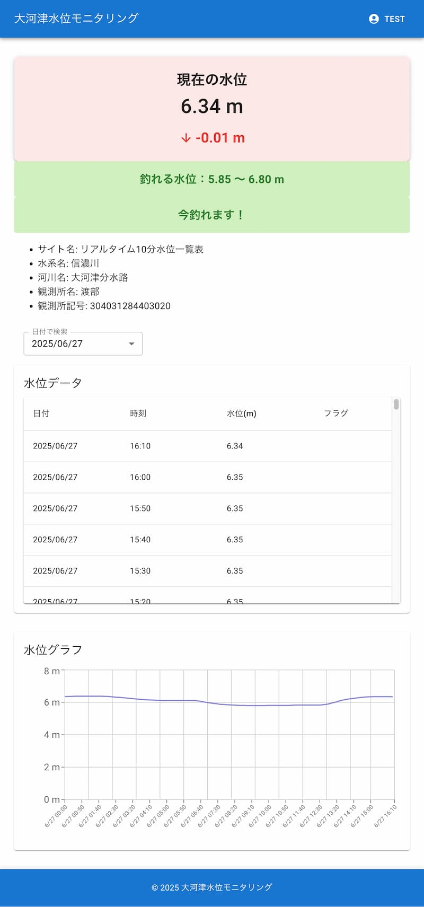

## river-front

river のフロントリポジトリです。

## アプリ概要

<br>

<br>

※現在開発中

私の地元河川では毎年一定の水量下で魚が釣れる統計があります。<br>
以前は国土交通省の水位情報からデータを取得し分析していましたが、
毎度国土交通省のデータを見るのも手間であり、それでいて魚の時合を逃したりしていました。<br>
そんな中、周りからの要望も多数あり、改良を加え使いやすく便利にしようとしたのが本アプリになります。

## 環境

- フレームワーク：Next.js
- ライブラリ：React
- 言語：TypeScript
- 非同期ライブラリ：axios
- Form ライブラリ：React Hook Form
- バリデーションライブラリ：zod
- フェッチライブラリ：SWR
- 状態管理ライブラリ：zustand
- UI ライブラリ：Material UI
- UI ライブラリ：Material Icons
- アニメーションライブラリ：framer-motion

## 環境構築

下記の流れに従って、環境構築を行なってください。

#### clone

```
git clone git@github.com:NarumiNaito/river-front.git
```

#### .env「.env.example をコピーし.env にリネームして下さい.」

```
cp .env.example .env
```

#### build

```
docker compose build
```

#### コンテナ作成

```
docker compose up -d
```

#### コンテナへの接続

```
docker compose exec app /bin/sh
```

## バックエンド

※ 注釈<br>
SPA 開発における GitHub のリポジトリについて、今回のアプリはフロントエンドとバックエンドを別々で作成し開発を行っています。
<br>
バックエンドのリポジトリについては下記を参照ください。
<br>

river-api-server 参照 URL ▶ <a href="https://github.com/NarumiNaito/river-api-server" target="_blank" rel="noopener noreferrer">https://github.com/NarumiNaito/river-api-server</a>
<br>

river-api-scraping 参照 URL ▶ <a href="https://github.com/NarumiNaito/river-api-scraping" target="_blank" rel="noopener noreferrer">https://github.com/NarumiNaito/river-api-scraping</a>
<br>
<br>
